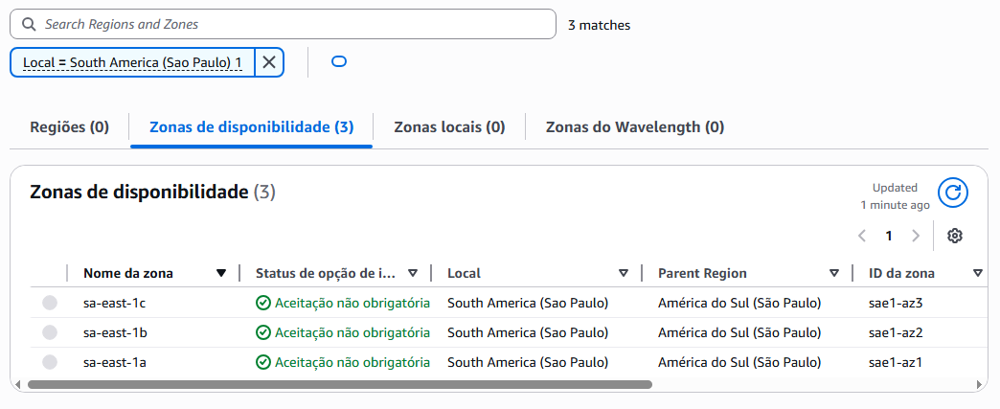
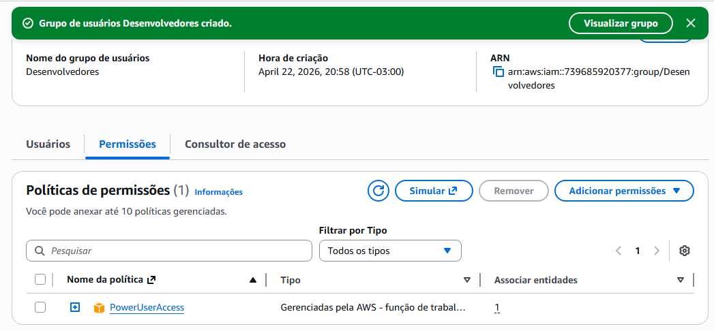
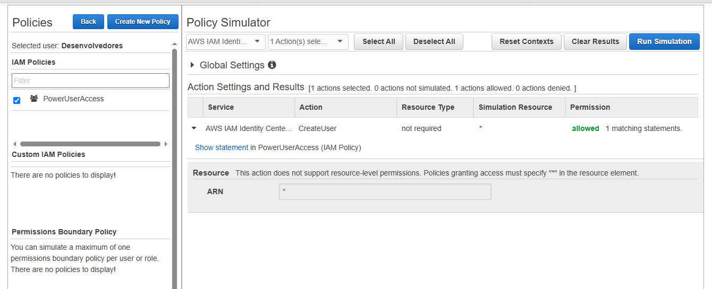

# TF08 - Relatório da Caça ao Tesouro na AWS

## Aluno
- **Nome:** Rafaela Bianor de Azevedo
- **RA:** 6324518

---

## Evidências das Missões

### Missão 1: Explorando Zonas de Disponibilidade

*Screenshot mostrando as Zonas de Disponibilidade de uma região:*



---

### Missão 2: Grupo "Desenvolvedores" com `PowerUserAccess`

*Screenshot do grupo IAM que criei, com a política de Power User anexada:*



---

### Missão 3: O JSON da Política de Administrador

*Este é o `Statement` da política `AdministratorAccess` que concede poder total:*

```json
{
    "Version": "2012-10-17",
    "Statement": [
        {
            "Effect": "Allow",
            "Action": "*",
            "Resource": "*"
        }
    ]
}
```

---

### Missão 4: Simulação de Política IAM

*Screenshot do IAM Policy Simulator mostrando que meu usuário `cli-user` **pode** criar novos usuários (ação `iam:CreateUser` permitida):*

